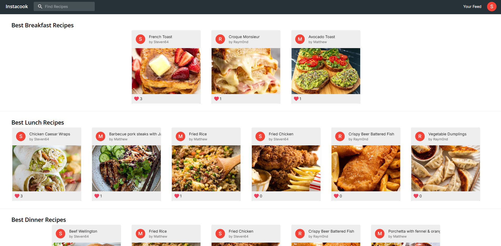
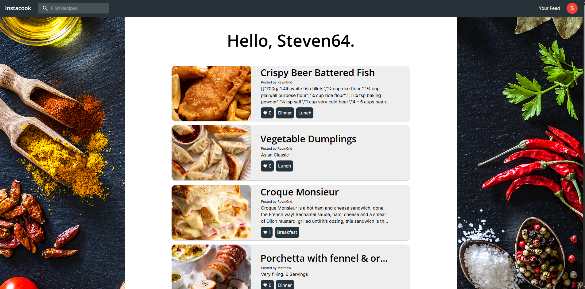
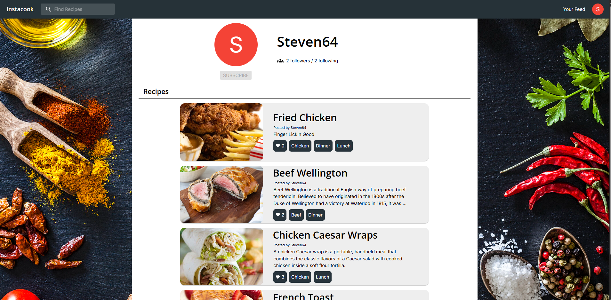
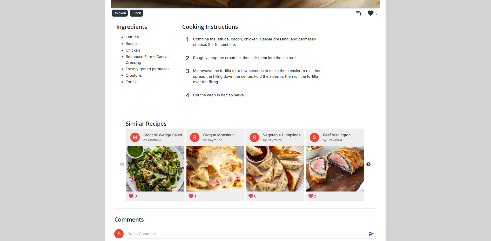
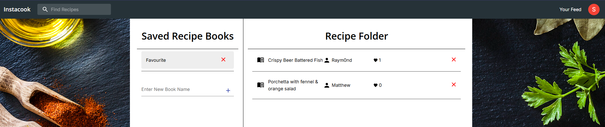

# Instacook - A Meal Recommendation App

**[Live Demo →](https://instacook-app.netlify.app/)**

A full-stack meal recommendation platform where users can discover, create, and save recipes. Features include user feeds, recipe books, social interactions (follow, like, comment), and tag-based search.







## Developers

### Frontend
- Matthew Lau
- Steven Nguyen
- Raymond Chung

### Backend
- Joe Nguyen
- Yuancong Cheng (Ryan)

## Tech Stack

| Layer | Technology |
|-------|-----------|
| Frontend | React.js, TypeScript, Material UI |
| Backend | GraphQL, Express.js, Node.js |
| Database | MongoDB Atlas (free M0 tier) |
| Frontend Hosting | Netlify |
| Backend Hosting | Render |

## Features

- **Recipe Discovery** - Browse recipes by category (meals, meat, drinks, desserts, cuisines, ingredients, cooking methods)
- **Search & Filter** - Full-text search with tag-based filtering
- **User Profiles** - View profiles, follow/unfollow users
- **Recipe Books** - Save recipes into custom collections
- **Social Interactions** - Like recipes, leave comments
- **News Feed** - See recipes from users you follow

## Prerequisites

- [Node.js](https://github.com/nvm-sh/nvm) (v14 or higher)
- A MongoDB Atlas account (free tier)

## Local Setup

### 1. Clone the repository

```bash
git clone https://github.com/Swxer/Instacook.git
cd Instacook
```

### 2. Set up MongoDB Atlas

1. Create an account at [mongodb.com/atlas](https://www.mongodb.com/atlas)
2. Build a database → select the **M0 Free** tier
3. Create a database user under **Security → Database Access**
4. Allow network access under **Security → Network Access** (add `0.0.0.0/0`)
5. Click **Connect** → **Connect your application** and copy the connection string

### 3. Configure the backend

```bash
cd backend
npm install
```

Create a `.env` file in the `backend/` directory:

```
MONGO_USER=your_db_username
MONGO_PASSWORD=your_db_password
MONGO_DB=comp3900
JWT_SECRET=your_secret_key
FRONTEND_URL=http://localhost:3000
NODE_ENV=development
```

Start the backend:

```bash
npm start
```

### 4. Configure the frontend

```bash
cd ../frontend
npm install
npm start
```

The frontend will open at `http://localhost:3000` and connect to the backend automatically.

## Deployment

- **Frontend** - Deployed on [Netlify](https://www.netlify.com/). Build config is in `netlify.toml`.
- **Backend** - Deployed on [Render](https://render.com/) as a Web Service.
- **Database** - Hosted on [MongoDB Atlas](https://www.mongodb.com/atlas) (M0 free tier, 512 MB storage).

Environment variables for production are configured in each platform's dashboard. Never commit `.env` files or secrets to version control.

## Side Notes

- The application may be slow on first load - Render free tier spins down after inactivity and takes ~30-60s to wake up
- The free MongoDB tier has 512 MB storage. Large recipe images (stored as base64) will consume this quickly
